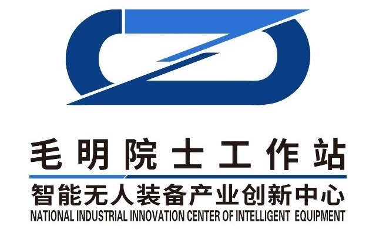








# Welcome! 
I'm a second year master student at [Graduate Institute of Biomedical Electronics and Bioinformatics](https://www.bebi.ntu.edu.tw/?page_id=79&lang=en), [National Taiwan University](https://www.ntu.edu.tw/english/), co-supervised by Prof. [Chung-Ping Chen](https://ieeexplore.ieee.org/author/37280747200) and Prof. [Wen-Shiang Chen](https://www.researchgate.net/profile/Wen-Shiang-Chen). 

My research interest includes Medical AI, Computer Vision, Bioengineering, and Bioinformatics.

You can find my CV here: [Jyun Ping Kao's Curriculum Vitae](../assets/CV.pdf). If you are interested in my work, please feel free to drop me an [email](mailto:jjpkao@gmail.com).

<!--插入图片语法为：-->

# 🔥 News
- *2024.10*: &nbsp;New Paper **Transformer Based Real Time Muscleskeletal Anatomical Structure Detection in Clinical Use** Accepted by **IEEE BIBE 2024**.
- *2024.09*: &nbsp;New Journal Paper **Enhancing Multi-Object Detection in Ultrasound Images Through Semi-Supervised Learning, Focal Loss and Relation of Frame** Accepted by **Ultrasound in Medicine & Biology 2024**.
- *2024.02*: &nbsp;New Paper **Real time musculoskeletal ultrasound image annotations** Accepted by **SPIE BISC 2024**.

# 📝 Publications 
- 🎓During My Master's Research Program

BISC 2024

[Real time musculoskeletal ultrasound image annotations](https://www.spiedigitallibrary.org/conference-proceedings-of-spie/13487/3052319/Real-time-musculoskeletal-ultrasound-image-annotations/10.1117/12.3052319.short)

Hao-Yu Hung, **Jyun-Ping Kao**, Hsin-Yuan Chu, Chung-Ping Chen, Wen-Shiang Chen

[**Project**](https://www.spiedigitallibrary.org/conference-proceedings-of-spie/13487/3052319/Real-time-musculoskeletal-ultrasound-image-annotations/10.1117/12.3052319.short)
<strong>Conference Paper</strong>
- Proc. SPIE 13487, Optics and Photonics International Congress 2024, doi: 10.1117/12.3052319

Ultrasound in Medicine & Biology

[Enhancing Multi-Object Detection in Ultrasound Images Through Semi-Supervised Learning, Focal Loss and Relation of Frame](https://www.sciencedirect.com/science/article/abs/pii/S030156292400320X)

Hsin-Yuan Chu, Chueh-Hung Wu, Ping-Xuan Chen, Hao-Yu Hung, **Jyun-Ping Kao**, et al.

[**Project**](https://www.sciencedirect.com/science/article/abs/pii/S030156292400320X)
<strong>SCI Journal Paper</strong>
- Ultrasound in Medicine & Biology, vol. 50 (12), pp. 1868-1878, 2024, doi: 10.1016/j.ultrasmedbio.2024.08.012

# 🎖 Honors and Awards
- *2023.06* The Phi Tau Phi Scholastic Honor Society of the Republic of China Honorary Membership (Top 1% in the school during undergraduate)
- *2023.06* 2023 Synopsys ARC AIoT Design Contest Award – Finalist
- *2023.02* Undergraduate Research Fellowship
- *2023.01* 2022 Intel DevCup x OpenVINO Toolkit Award – Finalist
- *2022.01* 2021 Intel DevCup x OpenVINO Toolkit Award –  Second Place

# 📖 Educations
- *2021.09 - 2024.07*, Master of Engineering in Control Engineering, North China University of Technology, Beijing, China
  - Supervised by [Dr. Jingjing Fan](https://lwss.ncut.edu.cn/TutorServlet?action=queryDs&teacherid=qq2scN_gHl_@_byvOok@JA==)
- *2017.09 - 2021.07*, Bachelor of Engineering in Software Engineering, Zhuhai College of Jilin University, Zhuhai, China
  - Supervised by [Prof. Yanchun Liang](https://ccst.jlu.edu.cn/info/1196/17215.htm)

<!--
# 💬 Invited Talks
- *2021.06*, Lorem ipsum dolor sit amet, consectetur adipiscing elit. Vivamus ornare aliquet ipsum, ac tempus justo dapibus sit amet. 
- *2021.03*, Lorem ipsum dolor sit amet, consectetur adipiscing elit. Vivamus ornare aliquet ipsum, ac tempus justo dapibus sit amet.  \| [\[video\]](https://github.com/)
-->

# 💻 Research Experience

[DouBao - Large Language Model (LLM) Product](https://www.doubao.com/chat/)

**Department · China Content Quality and DataRocks · Mathematical Logic | Sequence · Data Science**
- Advised by Mr. Zhaojian Li
- Jun. 2023 - Jan. 2024

Workstation of Mao Ming, Academician, CAS

[Jiangsu Shengyu Intelligent Equipment Technology Co., Ltd. ](https://baike.baidu.com/item/%E6%99%BA%E8%83%BD%E6%97%A0%E4%BA%BA%E8%A3%85%E5%A4%87%E4%BA%A7%E4%B8%9A%E5%88%9B%E6%96%B0%E4%B8%AD%E5%BF%83/61692750)

**Sequence · Research and Development Engineer**
- Advised by Dr. Jingjing Fan
- Jul. 2022 - May. 2023

# 🎖 Honors and Awards
- *2023.06* The Phi Tau Phi Scholastic Honor Society of the Republic of China Honorary Membership (Top 1% in the school during undergraduate)
- *2023.06* 2023 Synopsys ARC AIoT Design Contest Award – Finalist
- *2023.02* Undergraduate Research Fellowship
- *2023.01* 2022 Intel DevCup x OpenVINO Toolkit Award – Finalist
- *2022.01* 2021 Intel DevCup x OpenVINO Toolkit Award –  Second Place

------

  <i>I know I am not the perfect one, yet aspire to chase the world and achieve greatness@Ming Zhan</i>

