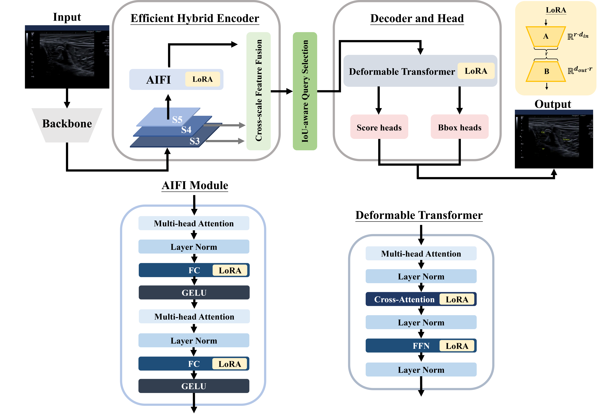
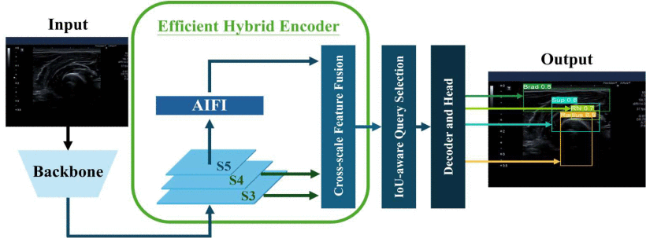
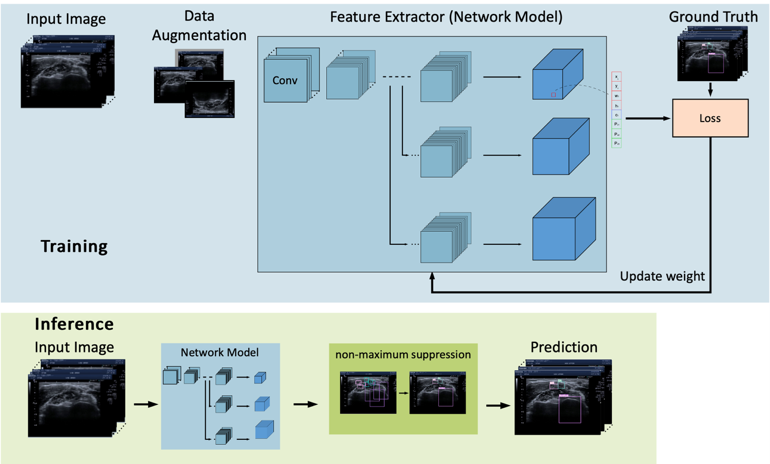
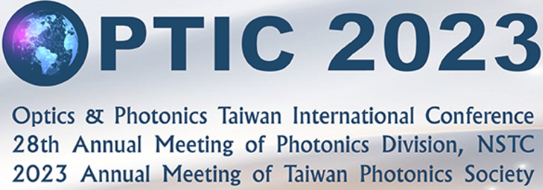








# Welcome! 
I am a Visiting Research Student in the Department of Radiology at [Harvard Medical School & Massachusetts General Hospital](https://jschant.github.io/) supervised by Prof. [Jonghye Woo](https://researchers.mgh.harvard.edu/profile/12882709/Jonghye-Woo), and a second-year master’s student at the [Graduate Institute of Biomedical Electronics and Bioinformatics](https://www.bebi.ntu.edu.tw/?page_id=79&lang=en), [National Taiwan University](https://www.ntu.edu.tw/english/), co-supervised by Prof. [Chung-Ping Chen](https://www.ee.ntu.edu.tw/profile1.php?teacher_id=943008) and Prof. [Wen-Shiang Chen](https://www.ntuh.gov.tw/PMR/Vcard.action?q_type=-1&q_itemCode=246). 

My research interests include Medical AI, Computer Vision, Bioengineering, and Bioinformatics.

I also served as Journal Reviewer ( **27 manuscripts in total** ) for **[IEEE Journal of Biomedical and Health Informatics](https://www.embs.org/jbhi/) (JCR Q1)**, **[Artificial Intelligence In Medicine](https://www.sciencedirect.com/journal/artificial-intelligence-in-medicine) (JCR Q1)**, **[Computerized Medical Imaging and Graphics](https://www.sciencedirect.com/journal/computerized-medical-imaging-and-graphics) (JCR Q1)**, **[International Journal of Medical Informatics](https://www.sciencedirect.com/journal/international-journal-of-medical-informatics) (JCR Q1)**, **[Biomedical Signal Processing and Control](https://www.sciencedirect.com/journal/biomedical-signal-processing-and-control) (JCR Q1)**, **[Journal of Imaging Informatics in Medicine](https://link.springer.com/journal/10278) (JCR Q1)**.

You can find my CV here: [Jyun Ping Kao's Curriculum Vitae](../assets/CV.pdf). If you are interested in my work, please feel free to drop me an [email](mailto:jjpkao@gmail.com) **(jjpkao@gmail.com)**.

# 🔥 News
- *2025.07*: &nbsp;New Conference Paper **MULTI-IMAGE MUSCULOSKELETAL ULTRASOUND INTERPRETATION USING A LARGE LANGUAGE MODEL** Accepted by **Radiological Society of North America Annual Meeting (RSNA 2025)**.
- *2025.06*: &nbsp;New Journal Paper **LoRA-Enhanced RT-DETR: First Low-Rank Adaptation Based DETR for Real-Time Full Body Anatomical Structures Identification in Musculoskeletal Ultrasound** Accepted by **Computerized Medical Imaging and Graphics**.
- *2025.05*: &nbsp;New Short Communication paper **Large Language Models in radiology: A technical and clinical perspective** Accepted by **European Journal of Radiology Artificial Intelligence**.
- *2024.10*: &nbsp;New Conference Paper **Transformer Based Real Time Muscleskeletal Anatomical Structure Detection in Clinical Use** Accepted by **IEEE BIBE 2024** for oral presentation.
- *2024.09*: &nbsp;New Journal Paper **Enhancing Multi-Object Detection in Ultrasound Images Through Semi-Supervised Learning, Focal Loss and Relation of Frame** Accepted by **Ultrasound in Medicine & Biology**.
- *2024.02*: &nbsp;New Conference Paper **Real time musculoskeletal ultrasound image annotations** Accepted by **SPIE BISC 2024** for poster presentation.
- *2023.10*: &nbsp;New Conference Paper **Deep-Learning-Enabled Third-Harmonic-Generation Imaging for Skin Virtual Biopsy from Reflectance Scanning Microscope** Accepted by **OPTIC 2023** for oral presentation.
- *2022.10*: &nbsp;New Conference Paper **Optical design and realization of nonlinear mesoscope** Accepted by **OPTIC 2022** for poster presentation.
  
# 📝 Publications 

CMIG

[LoRA-Enhanced RT-DETR: First Low-Rank Adaptation based DETR for real-time full body anatomical structures identification in musculoskeletal ultrasound](https://www.sciencedirect.com/science/article/abs/pii/S0895611125000928)

**Jyun-Ping Kao**, Yu-Ching Chung, Hao-Yu Hung, Chung-Ping Chen, Wen-Shiang Chen

<strong>Journal Paper</strong>
- Computerized Medical Imaging and Graphics, 2025, doi: 102583.10.1016/j.compmedimag.2025.102583

IEEE BIBE

[Transformer Based Real Time Musculoskeletal Anatomical Structure Detection in Clinical Use](https://ieeexplore.ieee.org/document/10820491)

**Jyun-Ping Kao**, Hao-Yu Hung, Ping-Xuan Chen, Chung-Ping Chen, Wen-Shiang Chen

<strong>Conference Paper</strong>
- 2024 IEEE 24th International Conference on Bioinformatics and Bioengineering (BIBE), Kragujevac, Serbia, 2024, pp. 1-6, doi: 10.1109/BIBE63649.2024.10820491.

BISC 2024

[Real time musculoskeletal ultrasound image annotations](https://www.spiedigitallibrary.org/conference-proceedings-of-spie/13487/3052319/Real-time-musculoskeletal-ultrasound-image-annotations/10.1117/12.3052319.short)

Hao-Yu Hung, **Jyun-Ping Kao**, Hsin-Yuan Chu, Chung-Ping Chen, Wen-Shiang Chen

<strong>Conference Paper</strong>
- Proc. SPIE 13487, Optics and Photonics International Congress 2024, doi: 10.1117/12.3052319

Ultrasound in Medicine & Biology

[Enhancing Multi-Object Detection in Ultrasound Images Through Semi-Supervised Learning, Focal Loss and Relation of Frame](https://www.sciencedirect.com/science/article/abs/pii/S030156292400320X)

Hsin-Yuan Chu, Chueh-Hung Wu, Ping-Xuan Chen, Hao-Yu Hung, **Jyun-Ping Kao**, Chung-Ping Chen, Wen-Shiang Chen

<strong>Journal Paper</strong>
- Ultrasound in Medicine & Biology, vol. 50 (12), pp. 1868-1878, 2024, doi: 10.1016/j.ultrasmedbio.2024.08.012

OPTIC2023

[Deep-Learning-Enabled Third-Harmonic-Generation Imaging for Skin Virtual Biopsy from Reflectance Scanning Microscope](https://optic2023.conf.tw/site/order/1495/SessionDetail.aspx?sid=1495&lang=en&snid=F&rmid=F04&rowid=6)

**Jyun-Ping Kao**, Xin Lin, You-Yang Zhang, Connie Liu, Shih-Hsuan Chia

<strong>Conference Paper</strong>
- 2023 Optics & Photonics Taiwan International Conference (OPTIC)

OPTIC2022

[Optical design and realization of nonlinear mesoscope](https://optic2022.conf.tw/site/order/1443/SessionDetail.aspx?sid=1443&lang=en&snid=F&rmid=F11&rowid=3)

**Jyun-Ping Kao**, Chu-Qiao Yu, Wei-Zhong Lin, Bo-Hsien Pan, Je-Chi Jang, Tien-Ching Tsai, Shih-Hsuan Chia

<strong>Conference Paper</strong>
- 2022 Optics & Photonics Taiwan International Conference (OPTIC)

# 📖 Educations
- *2023.08 - Present*, MS in Biomedical Electronics and Bioinformatics, National Taiwan University, Taiwan
  - GPA: 4.3/4.3 (Rank 1st in the department
- *2019.09 - 2023.08*, BS in Electronics and Electrical Engineering (Double Major) &  BS in Digital Healthcare (Double Major), National Yang Ming Chiao Tung University, Taiwan
  - Awards : Phi tau Phi Awards (Top 1 % student in the school)

# 🔬 Research Experience

**National Taiwan University Hospital (NTUH) · Department of Physical Medicine and Rehabilitation | Research Assistant**
- Advised by Prof. [Wen-Shiang Chen](https://www.researchgate.net/profile/Wen-Shiang-Chen)
- July 2023 - Present

**The University of Hong Kong (HKU) · Department of Orthopaedics and Traumatology | Visiting Research Student**
- Advised by Prof. [LAU, Chun Man Lawrence](https://www.ortho.hku.hk/biography/lau-chun-man-lawrence/)
- June 2024 - Present

**National Yang Ming Chiao Tung University (NYCU) · Institute of Biophotonics | Undergraduate Research Student**
- Advised by Prof. [Shih-Hsuan Chia](https://bioph.nycu.edu.tw/faculty/%E9%83%AD%E6%96%87%E5%A8%9F-%E6%95%99%E6%8E%88-%E6%89%80%E9%95%B7%E3%80%80dr-wen-chuan-kuo-professor-director/dr-shih-hsuan-chia-associate-professor/)
- July 2020 - Present

# 🎖 Honors and Awards
- *2023.06* The Phi Tau Phi Scholastic Honor Society of the Republic of China Honorary Membership (Top 1% in the school during undergraduate)
- *2023.06* 2023 Synopsys ARC AIoT Design Contest Award – Finalist
- *2023.02* Undergraduate Research Fellowship
- *2023.01* 2022 Intel DevCup x OpenVINO Toolkit Award – Finalist
- *2022.01* 2021 Intel DevCup x OpenVINO Toolkit Award –  Second Place

# 💡Extracurricular Experience

------

  <i>The grass withers and the flower fades, But the word of our God will stand forever. Isaiah40:8</i>

